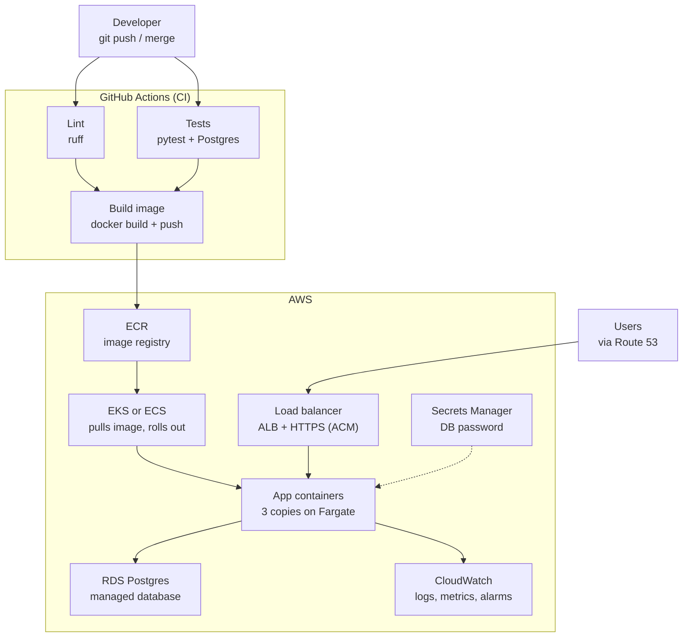

# Deployment: Docker, CI and AWS, from the ground up

Notes from AIENG-17 (W01, 8 Oct 2026). Written for someone new to Python and to cloud deployment.
The step-by-step commands live in [deploy-lightsail.md](../deploy-lightsail.md); this note explains the *why*.

**Core idea:** build the app into one **Docker image**, check it automatically in **CI**, then run that
same image on a **server**. Build once, run anywhere.

---

## 1. Docker

Docker packs the app, Python and every library into one **image**. The image runs the same way on a
laptop, in CI and on AWS. JVM comparison: like a fat JAR that also contains the OS and the runtime.

**[Dockerfile](../../Dockerfile): the recipe, in two stages**

```
Stage 1 (builder): Python + uv → install all libraries into .venv
Stage 2 (final):   fresh slim Python → copy only .venv + our code
```

- Build tools never reach the final image, which keeps it small.
- Runs as user `app`, **not root**, so a compromised app can do less damage.
- `HEALTHCHECK`: Docker calls `/health` every 30 seconds and marks the container healthy or unhealthy.
- [docker/entrypoint.sh](../../docker/entrypoint.sh) runs `alembic upgrade head` first, then starts uvicorn.

**[docker-compose.yml](../../docker-compose.yml): several containers together**

```
api  (our image)  ──talks to──▶  db (Postgres 17)
port published                   no port published (hidden)
```

- `depends_on: condition: service_healthy`: the API waits for Postgres to be ready.
- `volumes: pgdata`: database data survives container restarts.
- The DB password comes from `.env`, which is git-ignored and never committed.

**[.dockerignore](../../.dockerignore):** what stays out of the image (`.git`, `.env`, tests, docs).
It keeps secrets out and the image small.

**Useful commands**

| Command | What it does |
|---|---|
| `docker compose up -d --build` | Build and start everything in the background |
| `docker compose ps` | Status and health of each container |
| `docker compose logs api` | Logs, e.g. migrations running |
| `docker compose restart` | Restart (data is kept) |
| `docker compose down` | Stop and remove the containers (data volume is kept) |

---

## 2. CI with GitHub Actions

CI runs checks on GitHub's servers on every push and pull request. A red ❌ on a PR means don't merge.

**[.github/workflows/ci.yml](../../.github/workflows/ci.yml)**

```
lint ─┐
      ├──▶ build (Docker image, not pushed anywhere)
test ─┘
```

| Job | What it does |
|---|---|
| lint | `ruff check` and `ruff format --check` |
| test | Starts a throwaway Postgres 17, runs all tests |
| build | Builds the image, only if lint and test both passed |

**Safety:** `permissions: contents: read` (CI can't modify the repo), and no secrets at all, which
matters because the repo is public.

**Lesson learned:** the first CI run failed on lint. ruff also formats Python code blocks *inside
Markdown*, and the committed `docs/notes` snippets weren't formatted. It passed locally only because
the local copy differed from the committed one. Fix: exclude `docs/` from ruff. In general, CI checks
**the committed code**, not your working folder.

---

## 3. AWS Lightsail

Lightsail is AWS's **simple, fixed-price server** service.

| | Lightsail | EC2 (full AWS) |
|---|---|---|
| Price | Flat: $7/month includes server, disk, IP and traffic | Many separate charges |
| Setup | A few commands | VPC, subnets, security groups… |
| Surprise bills | Hard to get | Easy to get |
| Good for | Learning, prototypes, small apps | Large or complex production |

We used `micro_3_0`: 1 GB RAM, 2 vCPU, 40 GB disk, public IPv4, London (`eu-west-2`).

> ⚠️ A **stopped** Lightsail instance is still billed. **Delete** it when finished.

---

## 4. SSH: a secure remote terminal

SSH lets you run commands on the server from your Mac, encrypted.

**A key pair, not a password**

```
~/.ssh/incidentops_lightsail      ← PRIVATE key: never leaves the Mac
~/.ssh/incidentops_lightsail.pub  ← PUBLIC key: given to AWS → placed on the server
```

Think padlock and key: the public key is the padlock (safe to hand out), and the private key is the
only key that opens it. To log in, the Mac proves it holds the private key by signing a challenge,
and the server checks it with the public key. The private key itself is never sent.

```bash
ssh -i ~/.ssh/incidentops_lightsail ubuntu@<ip> 'docker compose ps'
#   ↑ which key                      ↑ user@server  ↑ command to run there
```

Leave out the quoted command and you get an interactive terminal on the server.

---

## 5. Firewall: `put-instance-public-ports`

A **port** is a numbered door on a server; each service listens behind one.

| Port | Service | Our rule |
|---|---|---|
| 22 | SSH | Only my IP (`x.x.x.x/32`) |
| 80 | HTTP (API) | Everyone (`0.0.0.0/0`) |
| 5432 | Postgres | **Closed** |

- `0.0.0.0/0` means every IP address; `/32` means exactly one IP.
- "put" **replaces the whole list**: anything not listed is closed. That closed Lightsail's default
  of SSH open to the whole world.
- Bots scan the internet for open SSH and database ports all the time. Closed doors can't be attacked.

---

## 6. scp: secure copy

`scp` copies files to or from a server over SSH, with the same keys and encryption.

```bash
scp -i ~/.ssh/incidentops_lightsail api-image.tar.gz docker-compose.yml ubuntu@<ip>:~/incidentops/
#                                  ↑ local files                       ↑ user@server:folder
```

The general form is `scp <from> <to>`, like `cp` but across machines.

---

## 7. What we actually did (AIENG-17)

```
Mac: docker buildx --platform linux/amd64   (Mac is ARM, server is x86 → must build for amd64)
Mac: docker save | gzip  → 66 MB file
Mac ──scp──▶ server: image + docker-compose.yml
Mac ──ssh──▶ server: docker load, create .env (random DB password, generated ON the server), docker compose up
Mac ──http─▶ http://<ip>/health → {"status":"ok"} ✅
Then: delete the instance (≈ 15 min, ≈ $0.01)
```

Verified from the internet: `/health`, create/read, idempotent replay, and that port 5432 is unreachable.

---

## 8. Is this how industry deploys?

**The core is the same:** the image is the unit you ship; build once, run everywhere; config from
environment variables; migrations on deploy; health checks.

**The plumbing is different:**

| Step | What we did (manual) | Industry standard |
|---|---|---|
| Who builds the image | Laptop | CI, after tests pass |
| How it gets to servers | `docker save` → `scp` → `docker load` | Push to a **registry** (ECR, GHCR); servers **pull** it |
| What runs it | `ssh` + `docker compose up` | An **orchestrator**: ECS/Fargate, Kubernetes (EKS), App Runner |
| Database | Postgres container on the same server | **Managed DB** (RDS / Aurora) with backups and failover |
| Secrets | `.env` file on the server | **Secrets Manager** / Parameter Store |
| Traffic | Port 80, plain HTTP | **Load balancer** + HTTPS, several copies |
| Updates | Stop old, start new (brief downtime) | Rolling / blue-green, auto-rollback |
| Infrastructure | CLI commands by hand | **Infrastructure as Code** (Terraform, CDK) |
| Trigger | Me | CI/CD: merge to `main` → deploy |

Images are tagged with the **git commit** (e.g. `incidentops-api:2961af9`), so you always know which
code is running, and rollback means "run the previous tag".

**Big tech** (Google, Meta) follows the same principles with **in-house tools**: Google runs **Borg**,
whose ideas Kubernetes was built on, and Meta runs **Tupperware/Twine**. The table above is the
standard for the thousands of companies on public clouds.

**Maturity path**

```
1. ssh + docker compose on one server        ← we are here (fine for prototypes)
2. + registry; CI builds and pushes the image
3. + CI deploys automatically on merge
4. + managed DB, HTTPS, secrets manager
5. + orchestrator, multiple copies, zero-downtime deploys
6. + Infrastructure as Code
```

---

## 9. The industry-standard flow on AWS



**AWS services for each step**

| Step | AWS service |
|---|---|
| Image registry | ECR |
| Orchestrator (Kubernetes) | EKS |
| Orchestrator (simpler, AWS-native) | ECS |
| Serverless containers | Fargate (with ECS or EKS) |
| Simplest container hosting | App Runner |
| Managed database | RDS / Aurora |
| Secrets | Secrets Manager / SSM Parameter Store |
| Load balancer / HTTPS | ALB / ACM (free certificates) |
| DNS | Route 53 |
| CI/CD | CodeBuild, CodePipeline (or GitHub Actions + OIDC) |
| Infrastructure as Code | CloudFormation, CDK (or Terraform) |
| Logs and metrics | CloudWatch, X-Ray |

**What Kubernetes (EKS) does for you:** schedules containers across servers, restarts crashed ones,
rolls out new versions with no downtime, and scales copies with traffic.

**Why not here (yet): rough minimum monthly costs**

| Piece | ≈ cost/month |
|---|---|
| EKS control plane | $73, even when idle |
| ALB | $16–20 |
| RDS (smallest) | $15–25 |
| NAT Gateway (common with EKS) | $35 |

That's over $100/month for one small API, against a $25 budget. For Kubernetes practice, use the free
**local** cluster built into OrbStack.

---

## 10. AWS account safety: lessons learned

**The Free plan versus the Paid plan (new accounts since July 2025)**

- The **Free plan** has no charges: usage is taken from credits for up to 6 months.
- The **Paid plan** is pay-as-you-go, with **no automatic spending cap**.
- Enabling **AWS Organizations, IAM Identity Center or Control Tower upgrades the account to Paid**,
  and you can't switch back. We hit this. Rule: if a screen mentions Organizations or Identity
  Center, stop.
- Plain **IAM** (users, MFA, policies) is free and never changes the plan.

**A budget only sends email; it doesn't stop spending.** The real protections:

1. **Keep keys from leaking.** That's the biggest risk: bots find keys pushed to GitHub within minutes.
   - MFA on root and on the IAM user; root has no access keys.
   - No permanent keys on the laptop: `aws login --profile incidentops` gives temporary credentials.
   - `.env` is git-ignored; GitHub push protection catches AWS keys.
2. **Budget** ($25/month; alerts at 50% and 100% actual, 80% forecast) plus **Cost Anomaly Detection**.
3. **Budget Actions** can automatically stop instances or apply a deny policy at a threshold.
4. **Fixed-price services** (Lightsail) for learning.
5. **Delete everything after testing**, and check that no instances, static IPs, disks or snapshots remain.

**Typical hidden costs to avoid:** NAT Gateways, idle load balancers, unattached static IPs, RDS left
running, and stopped (but not deleted) Lightsail instances.

**Account setup checklist (done 8 Oct 2026)**

- [x] Root: MFA, no access keys, used only for account and billing tasks
- [x] Daily IAM user `aniket-admin` with MFA (created with "I want to create an IAM user", not Identity Center)
- [x] Billing access activated for IAM users
- [x] Budget $25 with alerts; Cost Anomaly Detection on
- [x] CLI: `aws login --profile incidentops`, region `eu-west-2`
- [ ] Alternate contacts (Billing, Security)
